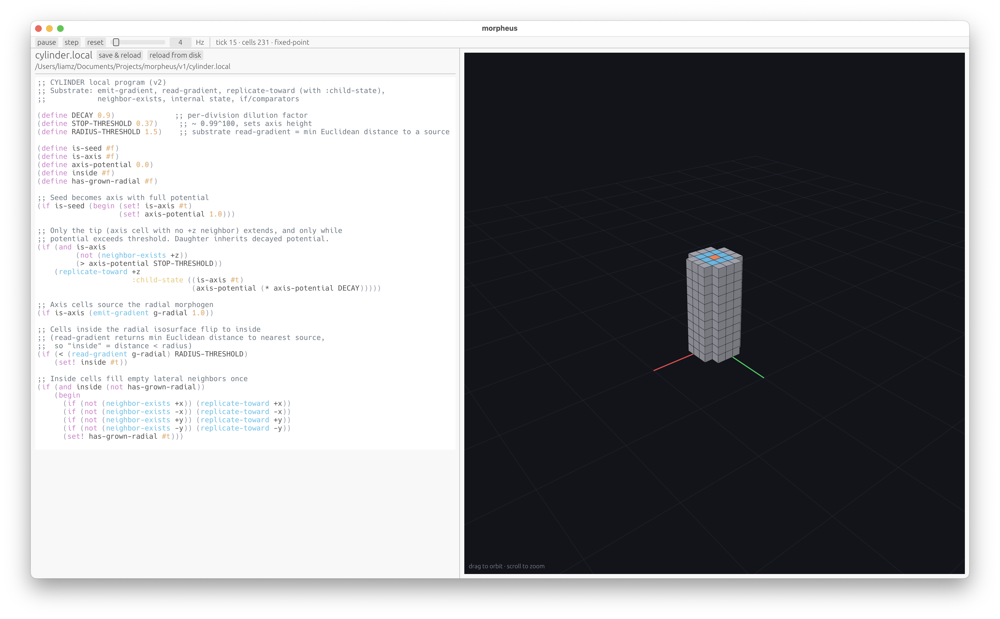
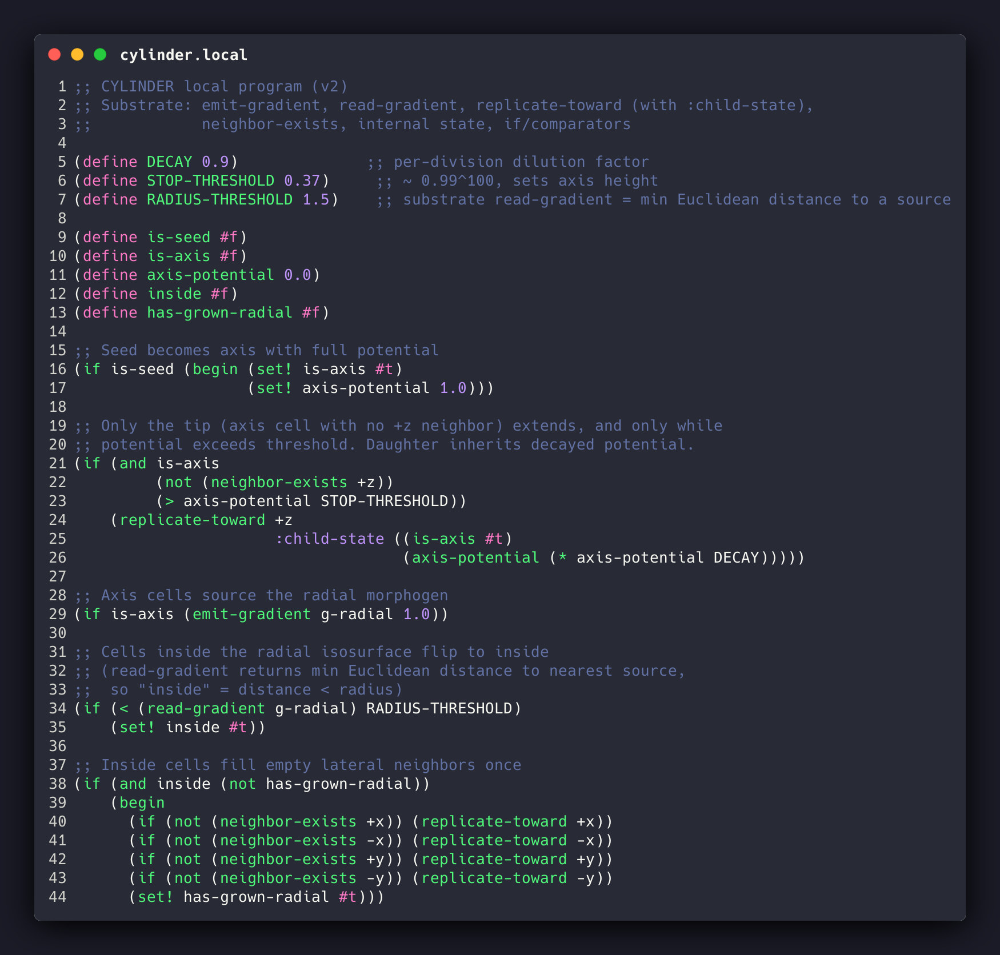
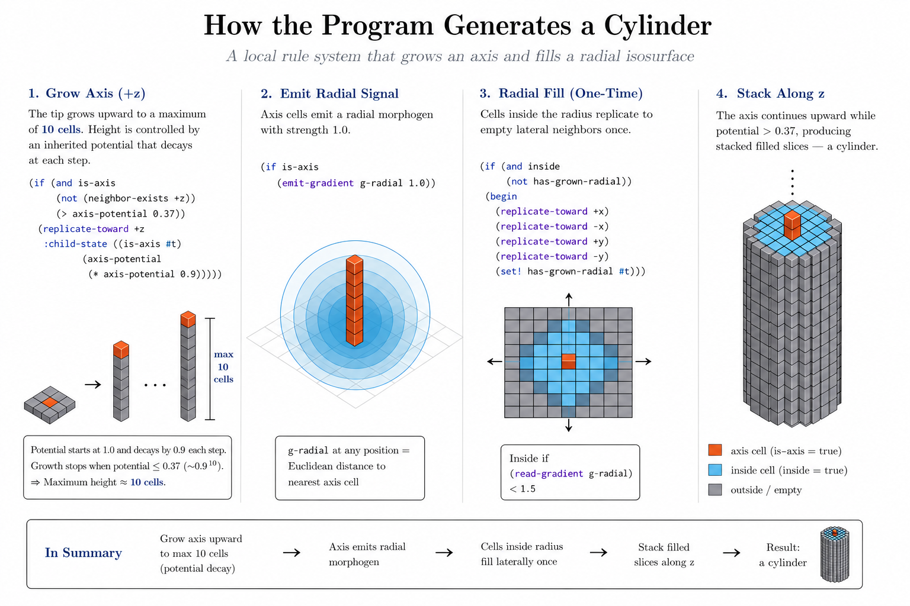

Morpheus V1
===========

<!-- 

I want to be able to program cells to grow into custom 3D shapes (morphology)

This is really hard. Every cell can only run the same code. How can only local computation result in global form?

Here's a bio-inspired Lisp runtime + voxel cell simulator where it happens!

A single seed cell self-assembles (divides and replicates), grows outwards and upwards, and then knows when to stop at a certain height. 

This is what the code looks like. Every cell runs this exact code. It figures out where it is in the morphology, where to build, and what signals to send to coordinate with others.

It's meant to mimic real biology, where signalling molecules create gradient fields, cells inherit state from parents, and GRN circuit motifs allow for Turing-ish computation 
 -->

## About.

I want to program cells to grow into 3D shapes. Unlike human design, you cannot design parts and glue them together. The cell is both something which prints the material (it divides and replicates) as well as something that arranges it into geometry. 

Every cell runs the same code. We call this the local program. And yet the code somehow generates 3D structure.

Morpheus is a simulator for morpheological development programs. It runs a voxel cell model, where every cell runs a Lisp program, which gives it a small amount of internal state, turing-complete operations, the ability to send/receive signals (hormones), and naturally - the ability to divide and replicate. 

## Demo.

A simple example is the cylinder. How do we write a cell program that grows an organoid shaped like a cylinder?

Cell program:

Organoid growth:

Code explainer:

